# Grocery - Data Warehouse Design (OLAP System)

**Responsible:** Keitumetse Dimpe  
**Student number:** 221806229

---

## 1. Overview

This document covers the complete design and implementation of the Grocery data warehouse built on PostgreSQL. It includes all three required tables, the star schema with five dimension tables and one fact table, and all SQL commands executed with screenshot evidence.

---

## 2. Schema and Required Tables

All warehouse tables are created inside a dedicated schema called `grocery`. The three tables required by the project brief are:

| Table | Description | Row Count |
|-------|-------------|-----------|
| `grocery.orders_dw` | Staging table loaded from MySQL | 70 order line rows |
| `grocery.customer_activity` | Staging table loaded from MongoDB | 25 activity rows |
| `grocery.customer_analytics` | Integrated table (SQL JOIN of both staging tables) | 34 rows |

---

## 3. Star Schema Design

The Grocery data warehouse follows a **Star Schema** design pattern. The central fact table (`fact_sales`) is surrounded by five dimension tables that provide descriptive context.

### 3.1 Table Roles

| Table | Role | Row Count | Description |
|-------|------|-----------|-------------|
| `fact_sales` | FACT TABLE | 70 | Stores measurable transaction rows with FK links to 4 dimensions |
| `dim_customer` | DIMENSION | 15 | Unique customers |
| `dim_product` | DIMENSION | 20 | Unique products with categories |
| `dim_date` | DIMENSION | 35 | Unique order dates (day/month/quarter/year) |
| `dim_payment` | DIMENSION | 4 | Payment methods (Cash, Card, EFT, Mobile) |
| `dim_activity` | DIMENSION | 3 | Activity types (Viewed, Added to Cart, Purchased) |

### 3.2 Star Schema Diagram


### 3.3 Text Representation

```
                      ┌──────────────────┐
                      │   dim_customer   │
                      │ PK customer_id   │
                      │    customer_name │
                      └────────┬─────────┘
                               │ FK customer_id
  ┌──────────────┐   ┌─────────▼──────────┐   ┌──────────────┐
  │ dim_product  │◀──│    fact_sales       │──▶│   dim_date   │
  │ PK product_id│FK │  PK sale_id         │FK │ PK date_id   │
  │ product_name │   │  FK customer_id     │   │  full_date   │
  │ category     │   │  FK product_id      │   │  day / month │
  └──────────────┘   │  FK date_id         │   │  quarter     │
                     │  FK payment_id      │   │  year        │
  ┌──────────────┐   │  quantity           │   └──────────────┘
  │ dim_payment  │◀──│  unit_price         │
  │PK payment_id │FK │  line_total         │
  │payment_method│   │  order_status       │
  └──────────────┘   └─────────────────────┘

  dim_activity (used via customer_analytics integration)
  ┌──────────────────────────────────────────────┐
  │ PK activity_id  |  activity_type             │
  │  Values: Viewed | Added to Cart | Purchased  │
  └──────────────────────────────────────────────┘

  PK = Primary Key    FK = Foreign Key    ──▶ = Relationship
```
---

## 4. Source Data Verification

Before building the data warehouse, the source OLTP systems were verified to ensure data availability.

### 4.1 MySQL OLTP Data (Orders)

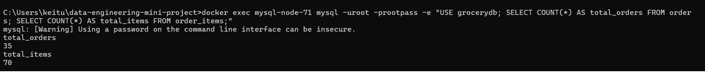  

**What the screenshot demonstrates:**
- `total_orders = 35` — confirms 35 orders exist in the source system
- `total_items = 70` — confirms 70 order line items, exceeding the 30‑record minimum requirement
- The `orders` and `order_items` tables contain the raw transactional data that will populate `orders_dw`  

### 4.2 MongoDB OLTP Data  

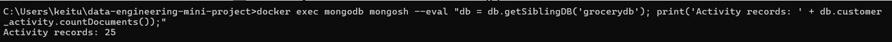

**What the screenshot demonstrates:**
- `Activity records: 25` — confirms 25 customer behavioral events.
- Documented activity types include: `Viewed`, `Added to Cart`, `Purchased`
- This collection provides the behavioral data that will populate `customer_activity`

---

## 5. PostgreSQL Data Warehouse Setup

### 5.1 Database Connection  

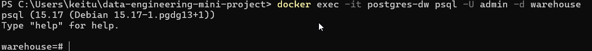  

**What the screenshot demonstrates:**
- Successful connection to the `postgres-dw` container via `docker exec`
- The `warehouse=#` prompt confirms an active PostgreSQL session authenticated as user `admin`
- The `warehouse` database is ready to receive DDL and DML commands  

### 5.2 Schema and Table Creation  

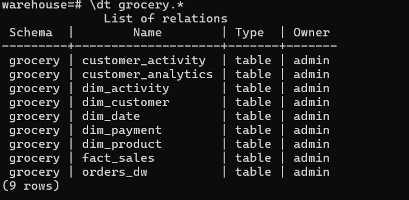  

**What the screenshot demonstrates:**
- `CREATE SCHEMA` — the `grocery` namespace was successfully created
- Nine `CREATE TABLE` statements executed without errors
- All three required tables created: `orders_dw`, `customer_activity`, `customer_analytics`
- All five dimension tables created: `dim_customer`, `dim_product`, `dim_date`, `dim_payment`, `dim_activity`
- The fact table `fact_sales` created with foreign key references to all four applicable dimensions
- Complete DDL is available in [`01_create_schema_and_tables.sql`](./sql-scripts/data-warehouse-scripts/01_create_schema_and_tables.sql)

### 5.3 orders_dw Structure

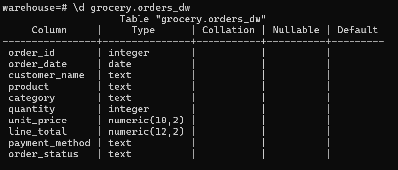

**What the screenshot demonstrates:**
- Ten columns defined, exactly matching the MySQL source schema
- Key columns: `order_id`, `order_date`, `customer_name`, `product`, `quantity`, `unit_price`, `line_total`, `payment_method`, `order_status`
- The structure supports direct `COPY` from the cleaned CSV output of the MySQL extraction  

### 5.4 customer_activity Structure  

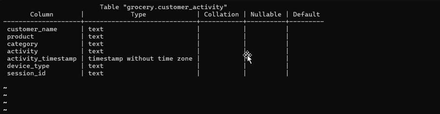  

**What the screenshot demonstrates:**
- Seven columns defined, matching the MongoDB document structure
- Key columns: `customer_name`, `product`, `activity`, `activity_timestamp`, `device_type`, `session_id`
- The `activity` column captures behavioral events: `Viewed`, `Added to Cart`, `Purchased`  


### 5.5 customer_analytics Structure

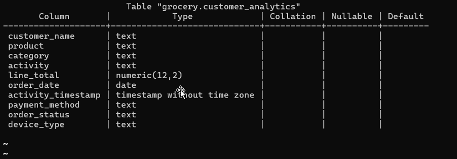

-**What the screenshot demonstrates:**
- Ten columns combining attributes from both source systems
- Transactional fields: `line_total`, `order_date`, `payment_method`, `order_status`
- Behavioral fields: `activity`, `activity_timestamp`, `device_type`
- This unified structure enables cross‑domain analytical queries

### 5.6 Foreign Key Constraints

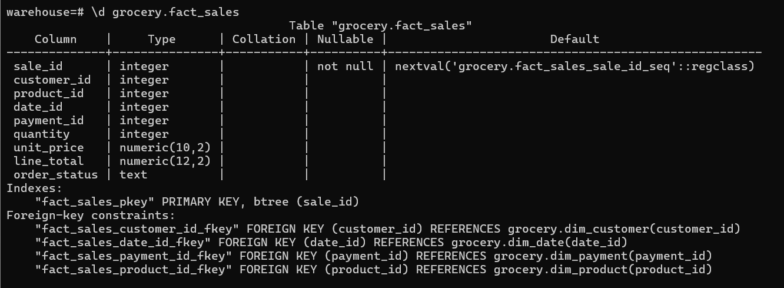

**What the screenshot demonstrates:**
- Four foreign key constraints confirmed on `fact_sales`
- Reference mapping:
  - `customer_id` → `dim_customer(customer_id)`
  - `product_id` → `dim_product(product_id)`
  - `date_id` → `dim_date(date_id)`
  - `payment_id` → `dim_payment(payment_id)`
- These constraints enforce referential integrity, a mandatory characteristic of a properly implemented star schema

---

## 6. Data Loading

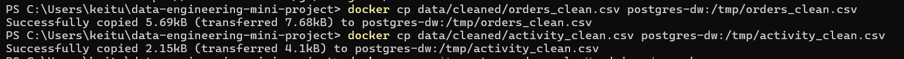

**What the screenshot demonstrates:**
- `orders_clean.csv` successfully copied to `/tmp/orders_clean.csv` inside the PostgreSQL container
- `activity_clean.csv` successfully copied to `/tmp/activity_clean.csv`
- The `Successfully copied` messages confirm that the cleaned ETL output is accessible for `COPY` commands

### 6.2 Staging Table Loading

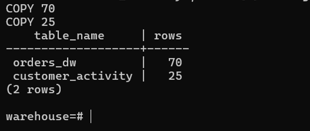

**What the screenshot demonstrates:**
- `COPY 70` — 70 rows inserted into `orders_dw`, matching the MySQL source count
- `COPY 25` — 25 rows inserted into `customer_activity`, matching the MongoDB source count
- The complete loading logic is documented in [`02_load_staging_data.sql`](./sql-scripts/data-warehouse-scripts/02_load_staging_data.sql)

---

## 7. Star Schema Population

### 7.1 Dimension Population

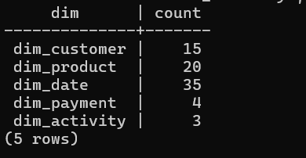

**What the screenshot demonstrates:**
- `dim_customer` — 15 distinct customers extracted from `orders_dw`
- `dim_product` — 20 distinct products extracted from `orders_dw`
- `dim_date` — 35 distinct order dates with derived attributes (day, month, quarter, year)
- `dim_payment` — 4 distinct payment methods (Cash, Card, EFT, Mobile)
- `dim_activity` — 3 distinct activity types (Viewed, Added to Cart, Purchased)
- Complete dimension population logic is available in [`03_populate_dimensions.sql`](./sql-scripts/data-warehouse-scripts/03_populate_dimensions.sql)

### 7.2 Fact Table Population


**What the screenshot demonstrates:**
- `INSERT 0 70` — 70 rows successfully inserted into `fact_sales`
- Verification query returns `70`, confirming complete load
- Each row links to dimension surrogate keys via the JOIN logic in [`04_populate_fact_table.sql`](./sql-scripts/data-warehouse-scripts/04_populate_fact_table.sql)

### 7.3 Star Schema Validation

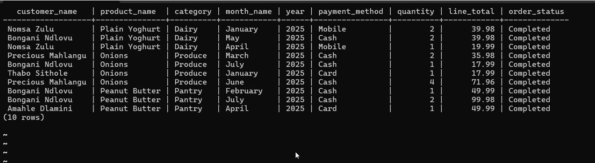

**What the screenshot demonstrates:**
- Successful four‑table JOIN traversing the complete star schema
- Columns returned: `customer_name`, `product_name`, `category`, `month_name`, `year`, `payment_method`, `quantity`, `line_total`, `order_status`
- The ten rows preview confirms all foreign key relationships are operational and the star schema is correctly materialized

---
