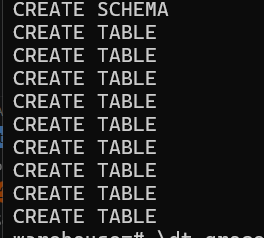

# Grocery - Data Warehouse Design (OLAP System)

**Responsible:** Keitumetse Dimpe

---

## 1. Overview

This document covers the complete design and implementation of the Grocery data warehouse built on PostgreSQL. It includes all three required tables, the star schema with five dimension tables and one fact table, and all SQL commands executed with screenshot evidence.

---

## 2. Schema and Required Tables

All warehouse tables are created inside a dedicated schema called `grocery`. The three tables required by the project brief are:

| Table | Description | Row Count |
|-------|-------------|-----------|
| `grocery.orders_dw` | Staging table loaded from MySQL | 70 order line rows |
| `grocery.customer_activity` | Staging table loaded from MongoDB | 25 activity rows |
| `grocery.customer_analytics` | Integrated table (SQL JOIN of both staging tables) | 34 rows |

---

## 3. Star Schema Design

The Grocery data warehouse follows a **Star Schema** design pattern. The central fact table (`fact_sales`) is surrounded by five dimension tables that provide descriptive context.

### 3.1 Table Roles

| Table | Role | Row Count | Description |
|-------|------|-----------|-------------|
| `fact_sales` | FACT TABLE | 70 | Stores measurable transaction rows with FK links to 4 dimensions |
| `dim_customer` | DIMENSION | 15 | Unique customers |
| `dim_product` | DIMENSION | 20 | Unique products with categories |
| `dim_date` | DIMENSION | 35 | Unique order dates (day/month/quarter/year) |
| `dim_payment` | DIMENSION | 4 | Payment methods (Cash, Card, EFT, Mobile) |
| `dim_activity` | DIMENSION | 3 | Activity types (Viewed, Added to Cart, Purchased) |

### 3.2 Star Schema Diagram

> Insert full-colour star schema diagram screenshot here
> (Open `star_schema_diagram.html` in browser → screenshot → paste below)


### 3.3 Text Representation

```
                      ┌──────────────────┐
                      │   dim_customer   │
                      │ PK customer_id   │
                      │    customer_name │
                      └────────┬─────────┘
                               │ FK customer_id
  ┌──────────────┐   ┌─────────▼──────────┐   ┌──────────────┐
  │ dim_product  │◀──│    fact_sales       │──▶│   dim_date   │
  │ PK product_id│FK │  PK sale_id         │FK │ PK date_id   │
  │ product_name │   │  FK customer_id     │   │  full_date   │
  │ category     │   │  FK product_id      │   │  day / month │
  └──────────────┘   │  FK date_id         │   │  quarter     │
                     │  FK payment_id      │   │  year        │
  ┌──────────────┐   │  quantity           │   └──────────────┘
  │ dim_payment  │◀──│  unit_price         │
  │PK payment_id │FK │  line_total         │
  │payment_method│   │  order_status       │
  └──────────────┘   └─────────────────────┘

  dim_activity (used via customer_analytics integration)
  ┌──────────────────────────────────────────────┐
  │ PK activity_id  |  activity_type             │
  │  Values: Viewed | Added to Cart | Purchased  │
  └──────────────────────────────────────────────┘

  PK = Primary Key    FK = Foreign Key    ──▶ = Relationship
```
---

## 4. Step 1 — Verify MySQL Source Data

```bash
docker exec mysql-node-71 mysql -uroot -prootpass -e \
  "USE grocerydb; \
   SELECT COUNT(*) AS total_orders FROM orders; \
   SELECT COUNT(*) AS total_items FROM order_items;"
```

**Expected output:**
```
total_orders
35
total_items
70
```

**Screenshot — MySQL source data verified**


---

## 5. Step 2 — Verify MongoDB Source Data

```bash
docker exec mongodb mongosh --eval \
  "db = db.getSiblingDB('grocerydb'); \
   print('Activity records: ' + db.customer_activity.countDocuments());"
```

**Expected output:**
```
Activity records: 25
```

**Screenshot — MongoDB source data verified**


---

## 6. Step 3 — Open PostgreSQL Warehouse

```bash
docker exec -it postgres-dw psql -U admin -d warehouse
```

You will see `warehouse=#` — this confirms you are connected.

**Screenshot — PostgreSQL connection confirmed**


---

## 7. Step 4 — Create Schema and All Tables

Paste this entire block inside `warehouse=#`:

```sql
-- Create dedicated schema for the grocery data warehouse
CREATE SCHEMA IF NOT EXISTS grocery;

-- REQUIRED TABLE 1: orders_dw (staging from MySQL)
CREATE TABLE IF NOT EXISTS grocery.orders_dw (
    order_id       INT,
    order_date     DATE,
    customer_name  TEXT,
    product        TEXT,
    category       TEXT,
    quantity       INT,
    unit_price     NUMERIC(10,2),
    line_total     NUMERIC(12,2),
    payment_method TEXT,
    order_status   TEXT
);

-- REQUIRED TABLE 2: customer_activity (staging from MongoDB)
CREATE TABLE IF NOT EXISTS grocery.customer_activity (
    customer_name      TEXT,
    product            TEXT,
    category           TEXT,
    activity           TEXT,
    activity_timestamp TIMESTAMP,
    device_type        TEXT,
    session_id         TEXT
);

-- REQUIRED TABLE 3: customer_analytics (final integrated table)
CREATE TABLE IF NOT EXISTS grocery.customer_analytics (
    customer_name      TEXT,
    product            TEXT,
    category           TEXT,
    activity           TEXT,
    line_total         NUMERIC(12,2),
    order_date         DATE,
    activity_timestamp TIMESTAMP,
    payment_method     TEXT,
    order_status       TEXT,
    device_type        TEXT
);

-- DIMENSION 1: Customers
CREATE TABLE IF NOT EXISTS grocery.dim_customer (
    customer_id   SERIAL PRIMARY KEY,
    customer_name TEXT NOT NULL UNIQUE
);

-- DIMENSION 2: Products
CREATE TABLE IF NOT EXISTS grocery.dim_product (
    product_id   SERIAL PRIMARY KEY,
    product_name TEXT NOT NULL,
    category     TEXT NOT NULL
);

-- DIMENSION 3: Dates
CREATE TABLE IF NOT EXISTS grocery.dim_date (
    date_id    SERIAL PRIMARY KEY,
    full_date  DATE NOT NULL UNIQUE,
    day        INT,
    month      INT,
    month_name TEXT,
    quarter    INT,
    year       INT
);

-- DIMENSION 4: Payment Methods
CREATE TABLE IF NOT EXISTS grocery.dim_payment (
    payment_id     SERIAL PRIMARY KEY,
    payment_method TEXT NOT NULL UNIQUE
);

-- DIMENSION 5: Activity Types
CREATE TABLE IF NOT EXISTS grocery.dim_activity (
    activity_id   SERIAL PRIMARY KEY,
    activity_type TEXT NOT NULL UNIQUE
);

-- FACT TABLE: fact_sales (central table — FK references to all 4 dimensions)
CREATE TABLE IF NOT EXISTS grocery.fact_sales (
    sale_id      SERIAL PRIMARY KEY,
    customer_id  INT REFERENCES grocery.dim_customer(customer_id),
    product_id   INT REFERENCES grocery.dim_product(product_id),
    date_id      INT REFERENCES grocery.dim_date(date_id),
    payment_id   INT REFERENCES grocery.dim_payment(payment_id),
    quantity     INT,
    unit_price   NUMERIC(10,2),
    line_total   NUMERIC(12,2),
    order_status TEXT
);
```

**Screenshot — All tables created successfully**



---

## 8. Step 5 — Verify All Tables Created

```sql
\dt grocery.*
```

**Expected output — 9 tables listed:**
```
 Schema  |        Name        | Type  | Owner
---------+--------------------+-------+-------
 grocery | customer_activity  | table | admin
 grocery | customer_analytics | table | admin
 grocery | dim_activity       | table | admin
 grocery | dim_customer       | table | admin
 grocery | dim_date           | table | admin
 grocery | dim_payment        | table | admin
 grocery | dim_product        | table | admin
 grocery | fact_sales         | table | admin
 grocery | orders_dw          | table | admin
(9 rows)
```

 **Screenshot — 9 tables listed under grocery schema**


---

## 9. Step 6 — Check Table Structures

### orders_dw

```sql
\d grocery.orders_dw
```

 **Screenshot — orders_dw column definitions**


---

### customer_activity

```sql
\d grocery.customer_activity
```

 **Screenshot — customer_activity column definitions**


---

### customer_analytics

```sql
\d grocery.customer_analytics
```

**Screenshot — customer_analytics column definitions**


---

### fact_sales (shows FK constraints)

```sql
\d grocery.fact_sales
```

**Expected — shows 4 FK constraints:**
```
Foreign-key constraints:
    "fact_sales_customer_id_fkey" FOREIGN KEY (customer_id) REFERENCES grocery.dim_customer(customer_id)
    "fact_sales_date_id_fkey"     FOREIGN KEY (date_id)     REFERENCES grocery.dim_date(date_id)
    "fact_sales_payment_id_fkey"  FOREIGN KEY (payment_id)  REFERENCES grocery.dim_payment(payment_id)
    "fact_sales_product_id_fkey"  FOREIGN KEY (product_id)  REFERENCES grocery.dim_product(product_id)
```

**Screenshot — fact_sales with FK constraints visible**


---

## 10. Step 7 — Copy CSV Files into Container

Exit PostgreSQL first:

```sql
\q
```

Then copy the cleaned CSV files from your project folder into the PostgreSQL container:

```bash
docker cp data/cleaned/orders_clean.csv   postgres-dw:/tmp/orders_clean.csv
docker cp data/cleaned/activity_clean.csv postgres-dw:/tmp/activity_clean.csv
```

**Expected output:**
```
Successfully copied 5.69kB to postgres-dw:/tmp/orders_clean.csv
Successfully copied 2.15kB to postgres-dw:/tmp/activity_clean.csv
```

 **Screenshot — both files copied successfully**


---

## 11. Step 8 — Load Data into Staging Tables

Go back into PostgreSQL:

```bash
docker exec -it postgres-dw psql -U admin -d warehouse
```

Load the orders data:

```sql
COPY grocery.orders_dw(order_id, order_date, customer_name, product,
    category, quantity, unit_price, line_total, payment_method, order_status)
FROM '/tmp/orders_clean.csv'
DELIMITER ',' CSV HEADER;
```

Load the activity data:

```sql
COPY grocery.customer_activity(customer_name, product, category, activity,
    activity_timestamp, device_type, session_id)
FROM '/tmp/activity_clean.csv'
DELIMITER ',' CSV HEADER;
```

Verify both loaded:

```sql
SELECT 'orders_dw'        AS table_name, COUNT(*) AS rows FROM grocery.orders_dw
UNION ALL
SELECT 'customer_activity', COUNT(*) FROM grocery.customer_activity;
```

**Expected output:**
```
   table_name     | rows
------------------+------
 orders_dw        |   70
 customer_activity|   25
```

**Screenshot — COPY 70 and COPY 25 confirmed**


---

## 12. Step 9 — Populate Dimension Tables

```sql
-- Populate dim_customer from both staging tables
INSERT INTO grocery.dim_customer(customer_name)
SELECT DISTINCT customer_name FROM grocery.orders_dw
ON CONFLICT(customer_name) DO NOTHING;

-- Populate dim_product
INSERT INTO grocery.dim_product(product_name, category)
SELECT DISTINCT product, category FROM grocery.orders_dw
ON CONFLICT DO NOTHING;

-- Populate dim_date with time intelligence columns
INSERT INTO grocery.dim_date(full_date, day, month, month_name, quarter, year)
SELECT DISTINCT order_date,
    EXTRACT(DAY     FROM order_date)::INT,
    EXTRACT(MONTH   FROM order_date)::INT,
    TO_CHAR(order_date, 'Month'),
    EXTRACT(QUARTER FROM order_date)::INT,
    EXTRACT(YEAR    FROM order_date)::INT
FROM grocery.orders_dw
ON CONFLICT(full_date) DO NOTHING;

-- Populate dim_payment
INSERT INTO grocery.dim_payment(payment_method)
SELECT DISTINCT payment_method FROM grocery.orders_dw
ON CONFLICT(payment_method) DO NOTHING;

-- Populate dim_activity
INSERT INTO grocery.dim_activity(activity_type)
SELECT DISTINCT activity FROM grocery.customer_activity
ON CONFLICT(activity_type) DO NOTHING;
```

Verify all dimensions:

```sql
SELECT 'dim_customer' AS dim, COUNT(*) FROM grocery.dim_customer
UNION ALL SELECT 'dim_product', COUNT(*) FROM grocery.dim_product
UNION ALL SELECT 'dim_date',    COUNT(*) FROM grocery.dim_date
UNION ALL SELECT 'dim_payment', COUNT(*) FROM grocery.dim_payment
UNION ALL SELECT 'dim_activity',COUNT(*) FROM grocery.dim_activity;
```

**Expected output:**
```
     dim      | count
--------------+-------
 dim_customer |    15
 dim_product  |    20
 dim_date     |    35
 dim_payment  |     4
 dim_activity |     3
```

**Screenshot — all 5 dimension tables populated**


---

## 13. Step 10 — Populate Fact Table

```sql
INSERT INTO grocery.fact_sales(customer_id, product_id, date_id, payment_id,
    quantity, unit_price, line_total, order_status)
SELECT
    dc.customer_id,
    dp.product_id,
    dd.date_id,
    dpm.payment_id,
    o.quantity,
    o.unit_price,
    o.line_total,
    o.order_status
FROM grocery.orders_dw o
JOIN grocery.dim_customer dc  ON dc.customer_name  = o.customer_name
JOIN grocery.dim_product  dp  ON dp.product_name   = o.product
JOIN grocery.dim_date     dd  ON dd.full_date       = o.order_date
JOIN grocery.dim_payment  dpm ON dpm.payment_method = o.payment_method;

SELECT COUNT(*) AS fact_rows_loaded FROM grocery.fact_sales;
```

**Expected output:**
```
 fact_rows_loaded
-----------------
              70
```

**Screenshot — fact_sales loaded with 70 rows**


---

## 14. Step 11 — Star Schema Verification Join

This query proves the star schema works end-to-end by joining the fact table back to all its dimensions:

```sql
SELECT
    dc.customer_name,
    dp.product_name,
    dp.category,
    dd.month_name,
    dd.year,
    dpm.payment_method,
    fs.quantity,
    fs.line_total,
    fs.order_status
FROM grocery.fact_sales fs
JOIN grocery.dim_customer dc  ON fs.customer_id = dc.customer_id
JOIN grocery.dim_product  dp  ON fs.product_id  = dp.product_id
JOIN grocery.dim_date     dd  ON fs.date_id     = dd.date_id
JOIN grocery.dim_payment  dpm ON fs.payment_id  = dpm.payment_id
ORDER BY fs.sale_id
LIMIT 10;
```

**Screenshot — star schema full join showing all dimension data**


---
